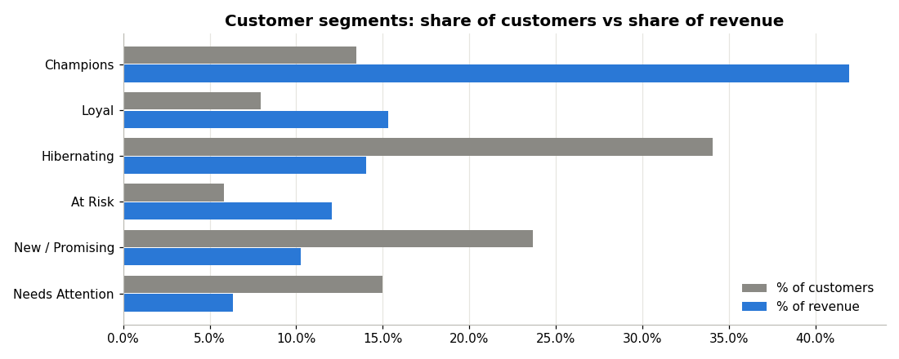
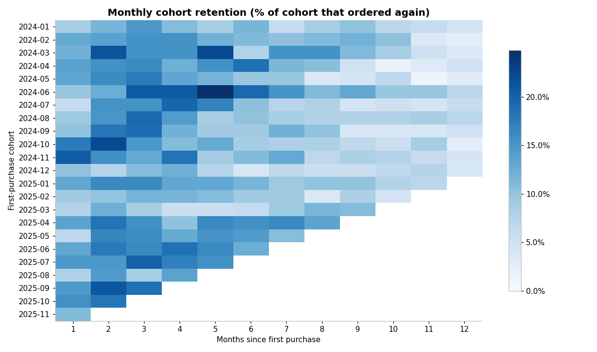
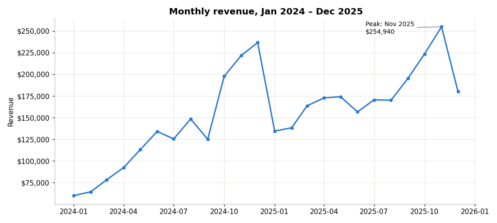

# E-commerce Customer Segmentation & Retention Analysis (Python)

An end-to-end analysis of 50,000+ online-retail transactions (Jan 2024 – Dec 2025) that
answers three business questions:

1. **Who drives revenue?** (RFM customer segmentation)
2. **How well does the business keep customers?** (cohort retention)
3. **Where should the marketing budget go?** (insights and recommendations)

**Tools:** Python, Pandas, NumPy, Matplotlib, Jupyter Notebook

> **Note:** The dataset is **simulated** (generated by `generate_data.py`). It is built to
> look like a real e-commerce order export, including real-world data-quality problems.

---

## Key results

| Metric | Value |
|---|---|
| Raw rows → clean customer sales lines | 50,227 → 46,625 |
| Revenue | $3.73M |
| Orders / Customers | 8,267 / 2,993 |
| Average order value | $451 |
| Repeat-customer rate | 38.5% |

- **Champions (13% of customers) generate 42% of revenue.** The top 20% of customers generate 63%.
- **175 high-value "At Risk" customers** have not ordered in about 15 months. They account for $431K of past revenue.
- **Only 12% of new customers order again in their second month.** 62% never come back after their first month.
- **Q4 brings 35% of annual revenue**, and revenue grew 34% year over year.





## Recommendations

- Run a win-back campaign for **At Risk** customers before Q4. Winning back 20% of them could recover about $86K.
- Protect **Champions** with a loyalty or early-access programme.
- Add a **post-purchase email flow** in the first 30 days to lift second-purchase rates.
- Plan stock and marketing budget around the **November peak**, especially for Lighting.

## What the project covers

1. **Data-quality audit.** Counts duplicates, returns, missing customer IDs, invalid prices and messy text before any fixing.
2. **Data cleaning.** Each cleaning decision is documented, row counts are shown after every step, and `assert` validation checks confirm the result.
3. **KPIs.** Revenue, orders, average order value (AOV), return rate and repeat-customer rate.
4. **Trend analysis.** Monthly revenue, seasonality and year-over-year growth.
5. **Product and market analysis.** Revenue by category, product and country.
6. **RFM segmentation.** Customers are scored on Recency, Frequency and Monetary value and grouped into 6 segments.
7. **Cohort retention.** A heatmap shows what share of each monthly cohort orders again.
8. **Pareto analysis.** Shows how concentrated revenue is among customers.

## How to run

```bash
pip install -r requirements.txt
python generate_data.py           # creates retail_simulated.csv
jupyter notebook analysis.ipynb   # or open it in VS Code / Google Colab
```

## Project structure

```
├── analysis.ipynb          # full analysis with outputs
├── generate_data.py        # creates the simulated dataset
├── retail_simulated.csv    # raw simulated data
├── sales_clean.csv         # cleaned output
├── *.png                   # charts used in this README
└── requirements.txt
```

**Author:** Bamidele Yetunde · [LinkedIn](https://linkedin.com/in/bamideleyetunde) · [GitHub](https://github.com/bamidele-yetunde)
